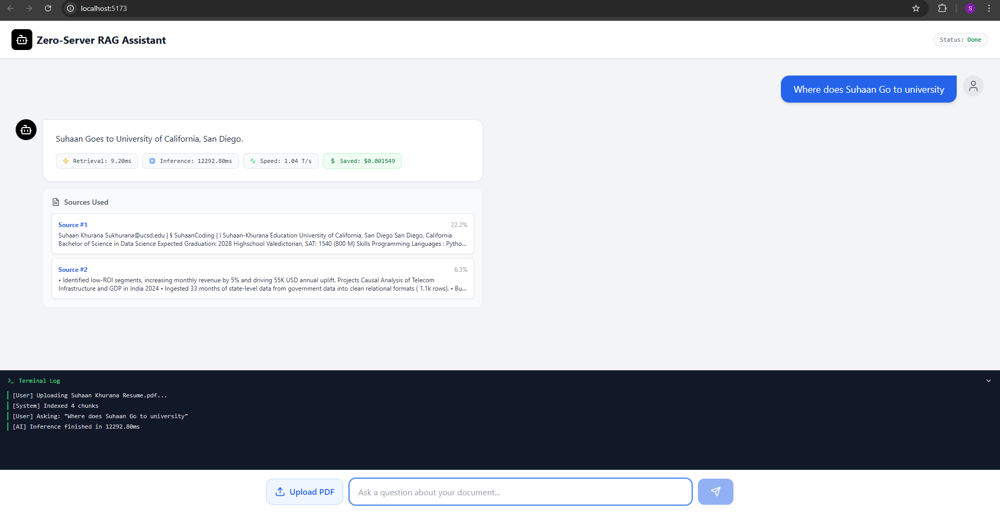

# ⚡ Zero-Server RAG Assistant

> **Run a full RAG (Retrieval-Augmented Generation) pipeline entirely in your browser. No API keys. No servers. 100% Privacy.**

   

## 📖 Overview

This project is a Proof-of-Concept for **Client-Side AI**. Unlike traditional RAG applications that send your sensitive PDF data to OpenAI or Pinecone, this application performs every step—PDF parsing, embedding generation, vector storage, and LLM inference—locally within the user's browser.

It utilizes **Web Workers** to ensure the UI remains buttery smooth while running heavy Transformer models in the background.

## 📸 Demo



## ✨ Key Features

* **🔒 Complete Privacy**: Your documents never leave your device.
* **💸 Zero Cost**: No bills from OpenAI, Anthropic, or vector database providers.
* **⚡ Web Worker Architecture**: Heavy AI inference runs on a separate thread, preventing UI freezes.
* **🧠 In-Browser Embeddings**: Uses `Xenova/all-MiniLM-L6-v2` for semantic search.
* **🤖 Local LLM**: Uses `Xenova/LaMini-Flan-T5-248M` for text generation.
* **📊 Real-time Metrics**: Tracks token speed (T/s), retrieval latency, and estimated cost savings.

## 🏗️ Architecture

How does it work without a backend?

1.  **User Uploads PDF**: The file is passed as an ArrayBuffer to the Web Worker.
2.  **PDF Parsing**: `PDF.js` extracts raw text from the document.
3.  **Chunking**: Text is split into overlapping segments to fit the model's context window.
4.  **Embedding**: The `all-MiniLM-L6-v2` model converts chunks into vector embeddings.
5.  **Vector Store**: Embeddings are stored in a local ephemeral array (in-memory).
6.  **Retrieval**: When the user asks a question, the system calculates Cosine Similarity between the query vector and stored vectors to find the top 2 most relevant chunks.
7.  **Generation**: The `LaMini-Flan-T5` model generates an answer based on the retrieved context.

## 🚀 Getting Started

### Prerequisites
* Node.js (v18+)
* npm or yarn

### Installation

1.  **Clone the repository**
    ```bash
    git clone [https://github.com/SuhaanCoding/Zero-Server-Rag.git](https://github.com/SuhaanCoding/Zero-Server-Rag.git)
    cd Zero-Server-Rag
    ```

2.  **Install dependencies**
    ```bash
    npm install
    ```

3.  **Run the development server**
    ```bash
    npm run dev
    ```

4.  **Open your browser**
    Navigate to `http://localhost:5173` (or your Vite port).

## 🛠️ Tech Stack

* **Frontend**: React + TypeScript + Vite
* **UI Components**: Lucide React (Icons), TailwindCSS
* **AI Engine**: [Transformers.js](https://huggingface.co/docs/transformers.js)
* **PDF Processing**: PDF.js
* **Concurrency**: Dedicated Web Workers

## ⚠️ Limitations

* **Initial Load**: The first time you run it, the browser must download the models (~200MB-500MB). These are cached for future use.
* **Context Window**: Limited by the specific model used (LaMini-Flan). Large documents are chunked to fit.
* **Hardware**: Performance depends on the user's CPU/GPU capabilities.

## 📄 License

[MIT](https://choosealicense.com/licenses/mit/)
